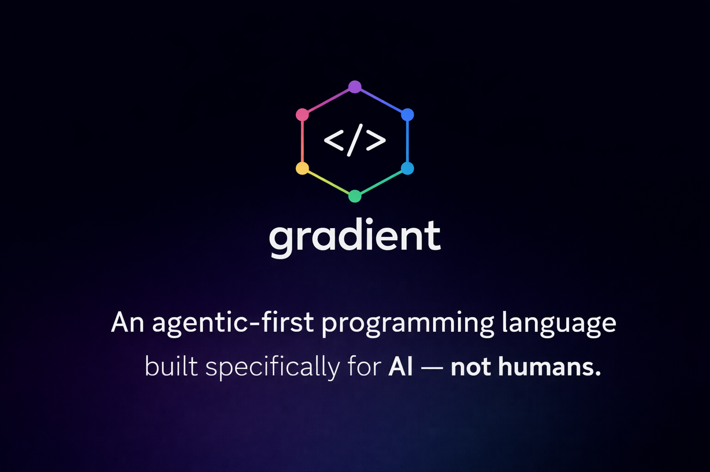

<div align="center">



<br/>
<br/>

**The first programming language where the compiler proves what your code can and cannot do.**

<br/>

[](https://github.com/graydeon/Gradient)
[](https://www.rust-lang.org)
[](LICENSE)
[](https://cranelift.dev)
[](#status)

</div>

---

## What is Gradient?

The research is clear on what makes AI code generation work:

- **Grammar-constrained decoding** eliminates syntax errors entirely (SynCode, XGrammar)
- **Type-directed generation** reduces compile errors by 75% (ETH Zurich, PLDI '25)
- **Enforced effects** let agents trust function signatures without reading implementations
- **Design-by-contract** enables generate-verify loops with 82--96% success rates (Dafny research)

Gradient is being built to deliver **all of these** in a single language. It is a statically-typed language designed for one specific programmer: an LLM operating under a context window budget, running generate-compile-fix loops at machine speed.

**What works today:**

- **Generics** -- `fn identity[T](x: T) -> T` and `type Option[T] = Some(T) | None` with bidirectional type inference at call sites
- **Effect polymorphism** -- lowercase effect variables (`!{e}`) resolve at call sites, enabling generic effectful abstractions
- **Design-by-contract** -- `@requires`/`@ensures` annotations with runtime contract checking. The `result` keyword in postconditions references the return value. Contract violations produce structured error messages. This enables the generate-verify workflow.
- **Grammar for constrained decoding** -- formal EBNF grammar (`resources/gradient.ebnf`) compatible with XGrammar, llguidance, and Outlines. Agents using Gradient through an inference engine can guarantee syntactically valid output.
- **Enforced effect system** -- every side effect (`IO`, `Net`, `FS`, `Mut`, `Time`) is tracked in the type system. Functions are pure by default, and the compiler *proves* purity.
- **Type-directed completion** -- `session.completion_context(line, col)` returns expected type, in-scope bindings, matching functions, and enum variants at any cursor position. Enhanced typed hole diagnostics.
- **Context budget tooling** -- `session.context_budget(fn_name, budget)` returns relevance-ranked context within a token budget. `session.project_index()` provides structural overview.
- **Budget annotations** -- `@budget(cpu: 5s, mem: 100mb)` on functions with compile-time containment checking (callee cannot exceed caller)
- **LLVM backend abstraction** -- `CodegenBackend` trait with Cranelift (debug) and LLVM (release, behind feature flag). `--release` flag selects the backend.
- **Package system** -- `gradient.toml` with `[dependencies]`, `gradient.lock` with SHA-256 checksums, dependency resolver with cycle detection and diamond dedup, `gradient add` and `gradient update` commands.
- **FFI bridges** -- `@extern("libm")` for importing C functions, `@export` for exporting Gradient functions with C-compatible linkage. FFI type validation ensures only compatible types cross the boundary.
- **Structured compiler API** -- agents call `Session::from_source`, `check()`, `symbols()`, `module_contract()` and get structured data back. No CLI scraping, no regex.
- **Module capabilities** -- `@cap` annotations restrict what effects a module is allowed to use. The compiler enforces the boundary.
- **Call graph analysis** -- the compiler builds and exposes the full call graph, enabling dependency analysis, dead code detection, and impact analysis.
- **Canonical formatter** -- one representation per program, eliminating style ambiguity for generators.
- **Compiler-verified rename** -- rename a symbol and the compiler guarantees correctness across the codebase.

**Shipped in Tier 4:**

- **Actor runtime** -- `actor` declarations with `state` fields, `on` message handlers, `spawn`/`send`/`ask` expressions, `Ty::Actor` type
- **Documentation generator** -- `///` doc comments, `session.documentation()`, `--doc` and `--doc --json` CLI flags

**Shipped in Tier 5 (Language Maturity):**

- **Closures and first-class functions** -- `|x: Int, y: Int| x + y` syntax, closures as arguments to higher-order functions, IR lowering as generated functions
- **Expanded standard builtins** -- 12 string builtins (`string_length`, `string_contains`, `string_trim`, etc.) and 6 numeric builtins (`pow`, `float_sqrt`, etc.) with Cranelift codegen via C library FFI
- **Test framework** -- `@test` annotation, `gradient test` command with discovery, harness generation, execution, reporting, and `--filter` flag
- **Tuple types** -- `(Int, String)` type expressions, `(1, "hello")` literals, `pair.0` numeric field access, `let (a, b) = pair` destructuring
- **Traits and interfaces** -- `trait` declarations with method signatures, `impl` blocks, trait bounds on generics (`[T: Display]`), `Self` type in trait methods
- **Result/Option types** -- built-in `Result[T, E] = Ok(T) | Err(E)` and `Option[T] = Some(T) | None`, `?` operator for error propagation, `is_ok`/`is_err` convenience functions
- **List type** -- `List[T]` with `[1, 2, 3]` literal syntax, 8 core builtins (`list_length`, `list_get`, `list_push`, `list_concat`, `list_is_empty`, `list_head`, `list_tail`, `list_contains`)
- **String interpolation** -- `f"hello {name}"` syntax with expression parsing inside `{}`, auto-conversion to string, `bool_to_string` builtin
- **Higher-order list functions** -- 9 builtins (`list_map`, `list_filter`, `list_fold`, `list_foreach`, `list_any`, `list_all`, `list_find`, `list_sort`, `list_reverse`) with full generic type inference and closure parameter validation
- **Method call syntax** -- `obj.method(args)` dispatching to free functions or trait methods, 20 builtin methods, chained method calls (`"hello".trim().length()`)
- **Pipe operator** -- `x |> f |> g` syntax desugaring to nested function calls, lowest precedence, left-associative
- **For-in loops** -- `for x in list:` and `for x in 0..10:` syntax, list iteration and range expressions
- **Match guards** -- `match` arm guards with `if condition`, variable binding patterns, string literal patterns
- **Match exhaustiveness checking** -- compiler warns on non-exhaustive `bool` and `enum` matches
- **Runtime fixes** -- real `int_to_string` implementation, list operations, and closure `call_indirect` now work at runtime
- **File I/O builtins** -- `file_read`, `file_write`, `file_exists`, `file_append` under the `FS` effect; C helpers in `runtime.c` linked alongside the compiled object file

**The compiler exists and works.** Gradient programs compile to native binaries via Cranelift. Hello world, recursive factorial, fibonacci, arithmetic, string concatenation, and math builtins all compile and run today.

---

## Quick Start

```bash
# Build the toolchain from source
git clone https://github.com/graydeon/Gradient.git
cd Gradient/codebase/build-system
cargo build
cd ../compiler
cargo build

# Create, build, and run a project
gradient new my-project
cd my-project
gradient build
gradient run
```

This creates a project with the following `src/main.gr`:

```
mod main

fn main() -> !{IO} ():
    print("Hello, Gradient!")
```

The `gradient build` command compiles `src/main.gr` to a native binary via Cranelift, then links it with `cc`. The `gradient run` command builds and immediately executes the result.

---

## Programs That Compile Today

### Hello World

```
fn main() -> !{IO} ():
    print("Hello from Gradient!")
```

### Factorial (recursion)

```
mod factorial

fn factorial(n: Int) -> Int:
    if n <= 1:
        ret 1
    else:
        ret n * factorial(n - 1)

fn main() -> !{IO} ():
    let result: Int = factorial(5)
    print_int(result)
```

### Fibonacci

```
mod fibonacci

fn fib(n: Int) -> Int:
    if n <= 0:
        ret 0
    else if n == 1:
        ret 1
    else:
        let a: Int = fib(n - 1)
        let b: Int = fib(n - 2)
        ret a + b

fn main() -> !{IO} ():
    let result: Int = fib(10)
    print_int(result)
```

### String Concatenation

```
mod string_concat

fn main() -> !{IO} ():
    let greeting: String = "Hello" + ", " + "Gradient!"
    print(greeting)
```

### While Loop with Mutable Bindings

```
mod countdown

fn main() -> !{IO} ():
    let mut i: Int = 5
    while i > 0:
        print_int(i)
        i = i - 1
    print("Liftoff!")
```

### Match Expression

```
mod match_demo

fn describe(n: Int) -> String:
    let label: String = match n:
        0:
            "zero"
        1:
            "one"
        _:
            "other"
    ret label

fn main() -> !{IO} ():
    print(describe(0))
    print(describe(1))
    print(describe(42))
```

### Enum Types

```
mod traffic

type Light = Red | Yellow | Green

fn action(light: Light) -> String:
    match light:
        Red:
            "stop"
        Yellow:
            "caution"
        Green:
            "go"

fn main() -> !{IO} ():
    print(action(Green))
```

### Design-by-Contract

```
mod contracts

@requires(n >= 0)
@ensures(result >= 1)
fn factorial(n: Int) -> Int:
    if n <= 1:
        ret 1
    else:
        ret n * factorial(n - 1)

@requires(a > 0)
@requires(b > 0)
@ensures(result > 0)
fn multiply_positive(a: Int, b: Int) -> Int:
    ret a * b

fn main() -> !{IO} ():
    print_int(factorial(5))
    print_int(multiply_positive(3, 4))
```

### Generics

```
mod generics

fn identity[T](x: T) -> T:
    ret x

type Option[T] = Some(T) | None

fn unwrap_or[T](opt: Option[T], default: T) -> T:
    match opt:
        Some(val):
            val
        None:
            default

fn main() -> !{IO} ():
    let x: Int = identity[Int](42)
    print_int(x)
    let name: String = identity[String]("Gradient")
    print(name)
```

### Effect Polymorphism

```
mod effects

fn apply[T, U](f: (T) -> !{e} U, x: T) -> !{e} U:
    ret f(x)

fn double(n: Int) -> Int:
    ret n * 2

fn print_and_return(n: Int) -> !{IO} Int:
    print_int(n)
    ret n

fn main() -> !{IO} ():
    let a: Int = apply(double, 21)
    print_int(a)
    let b: Int = apply(print_and_return, 42)
    print_int(b)
```

### FFI (Foreign Function Interface)

```
mod ffi_demo

@extern("libm")
fn sqrt(x: Float) -> Float

@export
fn gradient_add(a: Int, b: Int) -> Int:
    ret a + b

fn main() -> !{IO} ():
    let val: Float = sqrt(16.0)
    print_float(val)
```

### Math Builtins

```
mod math_builtins

fn main() -> !{IO} ():
    print_int(abs(-42))
    print_int(min(10, 3))
    print_int(max(10, 3))
    print_float(3.14)
    print_bool(true)
    print_int(17 % 5)
```

---

## Design Priorities

Eight research-validated principles, in priority order:

| # | Priority | What it means |
|---|---|---|
| 1 | **Verifiable correctness** | Enforced effects and design-by-contract (`@requires`/`@ensures`) shipped. Agents prove code correct, not just plausible |
| 2 | **Grammar-constrained generation** | LL(1) grammar with EBNF export for XGrammar/vLLM/Outlines -- structurally eliminates syntax errors |
| 3 | **Type-directed completion** | Rich type context at every cursor position guides generation; reduces compile errors by 75% (ETH PLDI '25) |
| 4 | **Structured compiler API** | Agents interact with the compiler through typed queries, not string parsing |
| 5 | **Token efficiency** | Every saved token is reclaimed context window and reduced inference cost |
| 6 | **Capability-based sandboxing** | Modules declare their allowed effects with `@cap`; the compiler enforces the boundary |
| 7 | **Enforced effects** | Five effects (`IO`, `Net`, `FS`, `Mut`, `Time`) tracked in the type system -- no silent side effects |
| 8 | **Unambiguous parseability** | One canonical form per construct; the formatter is a normalization function, not a style guide |

---

## Language Design

### Syntax
- **ASCII-only** -- no Unicode operators; every symbol is a single token in major LLM tokenizers
- **Indentation-significant** -- no braces for blocks, no semicolons, no redundant delimiters
- **Colon-delimited blocks** -- `fn`, `if`, `else`, `for`, `while`, `match` use `:` before their indented body
- **Keyword-led** -- `fn`, `let`, `if`, `for`, `while`, `match`, `ret`, `type`, `mod`, `use`, `impl`
- **One canonical form** per construct -- the formatter is a normalization function, not a style guide
- **LL(1)-parseable** -- context-free, unambiguous, enabling grammar-guided LLM decoding

### Type System
- Static type checking with inference for `let` bindings
- Five built-in types: `Int`, `Float`, `String`, `Bool`, `()`
- **Generics** -- type parameters on functions (`fn identity[T](x: T) -> T`) and enums (`type Option[T] = Some(T) | None`) with bidirectional type inference
- Effect annotations: `!{IO}` tracks side effects in function signatures
- **Effect polymorphism** -- lowercase effect variables (`!{e}`) resolve at call sites
- **Typed holes** -- write `?hole`, get compiler feedback on the expected type and matching completions
- **Budget annotations** -- `@budget(cpu: 5s, mem: 100mb)` with compile-time containment checking
- Error recovery -- the type checker reports all errors, not just the first

### Built-in Functions

| Function | Signature |
|---|---|
| `print` | `print(value: String) -> !{IO} ()` |
| `println` | `println(value: String) -> !{IO} ()` |
| `print_int` | `print_int(value: Int) -> !{IO} ()` |
| `print_float` | `print_float(value: Float) -> !{IO} ()` |
| `print_bool` | `print_bool(value: Bool) -> !{IO} ()` |
| `abs` | `abs(n: Int) -> Int` |
| `min` | `min(a: Int, b: Int) -> Int` |
| `max` | `max(a: Int, b: Int) -> Int` |
| `mod_int` | `mod_int(a: Int, b: Int) -> Int` |
| `to_string` | `to_string(value: Int) -> String` |
| `int_to_string` | `int_to_string(value: Int) -> String` |
| `range` | `range(n: Int) -> Iterable` |

The `+` operator also performs string concatenation, and `%` performs integer modulo.

---

## Agent-First Features

### Structured Query API

Agents interact with the compiler as a library, not by parsing CLI output.

```rust
let session = Session::from_source(src);
let diags    = session.check();       // type errors, effect mismatches
let syms     = session.symbols();     // every symbol with type + span
let contract = session.module_contract(); // public API surface
```

All results are structured data. No regex. No scraping.

### Enforced Effect System

Gradient tracks five effects: **IO**, **Net**, **FS**, **Mut**, **Time**.

Functions are **pure by default**. If a function performs IO, it must declare `!{IO}` in its signature. If it doesn't declare effects and doesn't call anything effectful, the compiler *proves* it is pure.

```
fn add(a: Int, b: Int) -> Int:       // proven pure -- no effects
    ret a + b

fn greet(name: String) -> !{IO} ():  // must declare IO
    print("Hello, " + name)
```

### Module Capabilities

Modules declare their allowed effects with `@cap`:

```
@cap(IO, Net)
mod http_client

fn fetch(url: String) -> !{IO, Net} String:
    ...
```

If a module tries to use an effect it hasn't declared, the compiler rejects it.

### Call Graph and Dependency Analysis

The compiler builds the full call graph and exposes it to agents. This enables:

- **Impact analysis** -- which functions are affected by a change?
- **Dead code detection** -- which functions are never called?
- **Dependency tracking** -- what does this function transitively depend on?

### Compiler-Verified Rename

Rename a symbol and the compiler guarantees correctness. The rename operation uses the type system and call graph to find every reference, including across module boundaries.

### CLI JSON Mode

Every analysis command supports `--json` for structured agent consumption:

```bash
gradient check --json        # type errors as JSON
gradient inspect --json      # symbols, types, spans as JSON
gradient effects --json      # effect annotations as JSON
```

---

## Compiler Architecture

```
Source (.gr)
    |
    v
Lexer (71 tests) ---------- Token stream with INDENT/DEDENT injection
    |
    v
Parser + AST (82 tests) --- Recursive descent, error recovery, generics, FFI
    |
    v
Type Checker (115 tests) -- Static types, inference, effects, contracts, generics
    |
    v
IR Builder (29 tests) ----- AST to SSA-form intermediate representation
    |
    v
Query API (74 tests) ------ Structured queries: symbols, contracts, completion, budgets
    |
    v
Effect System (14 tests) -- Enforced effect tracking, purity proofs, polymorphism
    |
    v
CodegenBackend trait ------- Cranelift (debug) or LLVM (release, feature-gated)
    |
    v
System Linker (cc) -------- Native executable binary
```

The full pipeline is wired end-to-end: `source.gr` goes in, a native binary comes out.

---

## Toolchain

Working CLI commands:

```
gradient new <name>      Create a new project (gradient.toml + src/main.gr)
gradient build           Compile to native binary (Cranelift backend)
gradient build --release Compile with LLVM backend (when compiled with llvm feature)
gradient run             Build and execute
gradient check           Type-check without emitting a binary
gradient fmt             Canonical formatter (--fmt flag on gradient-compiler)
gradient repl            Interactive session (--repl flag on gradient-compiler)
gradient test            Run @test-annotated functions (with --filter support)
gradient add <path>      Add a path-based dependency to gradient.toml
gradient update          Re-resolve dependencies and update gradient.lock
```

Scaffolded (not yet functional):

```
gradient init            Initialize project in current directory
```

### Project layout

```
my-project/
├── gradient.toml        # Manifest (with [dependencies] section)
├── gradient.lock         # Lockfile (SHA-256 content-addressed checksums)
├── src/
│   └── main.gr          # Entry point
└── target/
    ├── debug/           # Debug build output (Cranelift)
    └── release/         # Release build output (LLVM)
```

---

## LSP Server

Gradient ships an LSP server (`codebase/devtools/lsp/`) that provides:

- **Diagnostics** -- real-time lex, parse, and type-check errors on every file change
- **Hover** -- type and signature information for identifiers (builtins and user-defined functions)
- **Completions** -- keywords and builtin function names with signatures
- **`gradient/batchDiagnostics`** -- custom notification that sends all diagnostics for a file in one message, designed for AI agent consumers

The LSP server uses the same compiler pipeline as the CLI -- there is no separate parser or approximate analysis.

---

## Research Foundation

Gradient's roadmap is driven by a systematic literature review of 60+ papers spanning constrained decoding, type-directed synthesis, formal verification, and LLM code generation. The key finding: LLMs achieve 82--96% first-pass success rates when generating code against formal specifications (demonstrated in Dafny research), making design-by-contract the single highest-leverage feature to build. Grammar-constrained decoding (SynCode, XGrammar) and type-directed generation (ETH Zurich PLDI '25) round out the top tier. See the [full roadmap](docs/roadmap.md) for the prioritized research-backed feature list.

---

## Build Philosophy

Gradient is built **slow and modular**. At every point in development there is a working, testable artifact. Nothing is theoretical. Nothing ships without passing tests in a live environment.

The build roadmap is structured as progressive phases -- each one adding exactly one capability to the live system. The hard checkpoint was Phase 4: `gradient build` produces a real native binary from `.gr` source. That checkpoint is green.

---

## Status

Gradient is in **alpha**. The compiler works. Programs compile to native binaries. The test suite has **827 tests** across the lexer, parser, type checker, IR builder, query API, effect system, codegen backends, package system, FFI, actors, documentation generator, closures, tuples, test framework, expanded builtins, traits, Result/Option, lists, string interpolation, higher-order list functions, method call syntax, pipe operator, for-in loops, match guards, exhaustiveness checking, LSP server, formatter, REPL, and file I/O builtins.

Phases 0 through NN are **complete**. See the [roadmap](docs/roadmap.md) for details.

**What works:**
- Full compilation pipeline: source to native binary, including multi-file compilation
- Multi-file module resolution: `use math` resolves to `math.gr`, `use a.b` resolves to `a/b.gr`, with qualified calls across modules
- Generics: type parameters on functions (`fn identity[T](x: T) -> T`) and enums (`type Option[T] = Some(T) | None`) with bidirectional type inference
- Effect polymorphism: lowercase effect variables (`!{e}`) that resolve at call sites
- Closures and first-class functions: `|x: Int, y: Int| x + y` syntax, closures as higher-order function arguments, IR lowering as generated functions
- Tuple types: `(Int, String)` type expressions, `(1, "hello")` literals, `pair.0` numeric field access, `let (a, b) = pair` destructuring
- Test framework: `@test` annotation, `gradient test` with discovery, harness generation, execution, reporting, and `--filter`
- Expanded standard builtins: 12 string builtins and 6 numeric builtins with Cranelift codegen via C library FFI
- Recursion, arithmetic, conditionals, string concatenation, mutable bindings, while loops, pattern matching (match on int/bool/enum variants with wildcard)
- Traits and interfaces: `trait` declarations with method signatures, `impl` blocks, trait bounds on generics (`[T: Display]`), `Self` type in trait methods
- Result/Option types: built-in `Result[T, E]` and `Option[T]`, `?` operator for error propagation, `is_ok`/`is_err` convenience functions
- List type: `List[T]` with `[1, 2, 3]` literal syntax, 8 core builtins (`list_length`, `list_get`, `list_push`, `list_concat`, `list_is_empty`, `list_head`, `list_tail`, `list_contains`)
- String interpolation: `f"hello {name}"` syntax with expression parsing inside `{}`, auto-conversion to string
- Higher-order list functions: 9 builtins (`list_map`, `list_filter`, `list_fold`, `list_foreach`, `list_any`, `list_all`, `list_find`, `list_sort`, `list_reverse`) with full generic type inference
- Method call syntax: `obj.method(args)` dispatching to free functions or trait methods, 20 builtin methods, chained method calls
- Pipe operator: `x |> f |> g` syntax desugaring to nested function calls
- For-in loops: `for x in list:` and `for x in 0..10:` with list iteration and range expressions
- Match guards: `match` arm guards with `if condition`, variable binding patterns, string literal patterns
- Match exhaustiveness checking: compiler warns on non-exhaustive `bool` and `enum` matches
- Runtime fixes: real `int_to_string`, list operations, and closure `call_indirect` work at runtime
- File I/O builtins: `file_read(String) -> !{FS} String`, `file_write(String, String) -> !{FS} Bool`, `file_exists(String) -> !{FS} Bool`, `file_append(String, String) -> !{FS} Bool`; C helpers in `codebase/compiler/runtime.c`
- Enum types (algebraic data types) with unit variants; tuple variant payloads parsed but codegen deferred
- Type checking with inference and effect validation
- Enforced effect system with 5 effects (IO, Net, FS, Mut, Time)
- Design-by-contract: `@requires`/`@ensures` annotations with runtime contract checking, `result` keyword in postconditions, structured contract violation errors
- Budget annotations: `@budget(cpu: 5s, mem: 100mb)` with compile-time containment checking
- Grammar for constrained decoding: formal EBNF grammar for XGrammar/llguidance/Outlines integration
- Structured query API (Session::from_source, check, symbols, module_contract, completion_context, context_budget, project_index)
- Type-directed completion context at any cursor position
- Context budget tooling with relevance-ranked results
- Module capability constraints (`@cap` annotations)
- Call graph and dependency analysis
- Compiler-verified rename
- LLVM backend abstraction: `CodegenBackend` trait with Cranelift (debug) and LLVM (release, behind `llvm` feature flag), `--release` CLI flag
- Package system: `gradient.toml` with `[dependencies]`, `gradient.lock` lockfile with SHA-256 checksums, dependency resolver (cycle detection, diamond dedup, topological ordering), `gradient add` and `gradient update` commands
- FFI bridges: `@extern("libm")` for C imports, `@export` for C-compatible exports, FFI type validation, linkage metadata in query API
- Actor runtime: `actor` declarations with `state` fields and `on` message handlers, `spawn`/`send`/`ask` expressions, `Ty::Actor` type and `!{Actor}` effect
- Documentation generator: `///` doc comments attached to functions, types, enums, actors; `session.documentation()` and `session.documentation_text()` API; `--doc` and `--doc --json` CLI flags
- Working CLI (`gradient new/build/run/check/add/update`) with `--json` and `--release` output modes
- LSP server with diagnostics, hover, and completions
- Canonical formatter (`gradient fmt` / `--fmt`) with `--write` mode for in-place updates
- Interactive REPL (`gradient repl` / `--repl`) with type inference feedback and non-interactive piping support

**What's next:**
- Tuple variant codegen (enum payloads at runtime)
- Additional standard library builtins
- WASM compilation target

---

## Team

Gradient is built by Gray d'Eon.

---

## License

MIT -- see [LICENSE](LICENSE).

---

<div align="center">
<sub>built on research, verified by the compiler, trusted by agents</sub>
</div>
